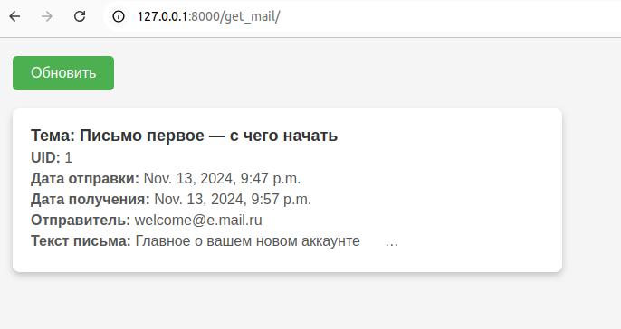

# Описание проекта

Данный проект представляет собой приложение для автоматической проверки почты, чтения входящих сообщений, правильного декодирования их содержимого, а также сохранения вложений и отображения данных на клиенте через WebSocket-соединение. Основные задачи приложения включают стабильное чтение почты, обработку сообщений и файлов, а также визуализацию прогресса в виде динамического прогресс-бара.



# Стек технологий и библиотеки

- **Python 3.11**
  - Django 4.2.11
  - Daphne
  - Django Channels
  - HTML/JavaScript
  - ImapTools

# Функциональность

- **Обработка писем**: Автоматическая проверка новых писем с сервера (mail.ru) и добавление их в базу данных.
- **Хранение данных**: Сохранение обработанных писем и их вложений в базе данных.
- **WebSocket-соединение**: Реализовано соединение для обновления данных на клиенте в режиме реального времени.
- **Интерфейс**: Простой интерфейс с использованием WebSocket для получения сообщений и автообновления.
- **Настройка ASGI**: Подключение и настройка ASGI для поддержки асинхронного взаимодействия.

# Настройка и запуск


В директории `maildownloaderapp` создайте файл `.env` с указанием необходимых переменных:

## Создать в директории maildownloaderapp файл .env c указанием переменных.

```
SECRET_KEY=django-secret-code
IMAP_HOST=imap.mymail.ru
IMAP_USER=user
IMAP_PASSWORD=pass
```
## Cоздать окружение и установить зависимости
```
cd maildownloader/
python -m venv venv
source venv/bin/activate
pip instll -r requirements.txt
```
## Запустить проект на Daphne
```
python manage.py migrate
python manage.py runserver
```
## Cтраница будет доступна по адресу:
```
http://127.0.0.1:8000/get_mail/
```


